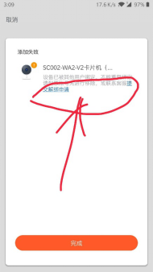
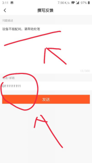
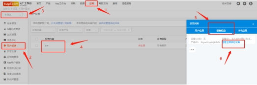
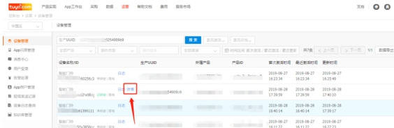
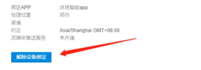

# IOT平台上解绑设备

* IoT平台设备解绑：

* 作用：

IoT平台解绑设备，应用于服务用户反馈的设备与帐号的解绑需求。

场景：用户在配网设备时，有时会发现设备一杯绑定，在拿到解绑需求时，请客户在APP的界面提交解绑申请，如下图。

  

* 设备解绑的前提条件：

1.1确认设备PID在IoT帐号，平台可以操作解绑IoT帐号下PID的设备

1.2 IoT帐号在被授权为带有【运营】权限的角色且关联到PID时，可以解绑对应PID所属的设备

2 已知用户反馈的的设备ID

* 查找用户反馈与设备ID并解绑：

1 在IoT平台首页点击顶部【运营】->点击【用户反馈】->选择正确区域->查找需要解绑的信息，按下图流程操作

 

2 在第6步完成后的新界面点击【详情】

 

3 在【详情】页面点击【解除设备被绑定】

 

* 备注：

在执行设备解绑操作时，要进行申请人的身份的充分核实