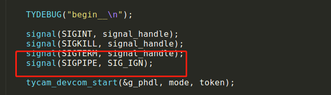

# chromecast和echo问题

1、chromecast功能开发流程？  
提供设备 PID 并联系项目经理开通 Chromecast 功能  
调用 Chromecast 初始化函数：TUYA_APP_Enable_EchoShow_Chromecast  
设定额外音频通道：E_CHANNEL_AUDIO_2RD，并对 E_CHANNEL_AUDIO_2RD 申请内存  
Chromecast 音频要求： 音频格式：AAC（ADTS）、采样率：8k 、位宽：16bit、单声道、pts
使用微秒（usec），若编解码出来的时间单位是毫秒，乘以 1000 输出微秒,若设备端无法直接输出 AAC 音频格式，可以下载 fdk-aac 开源库，将 PCM 音频格式转换为AAC（ADTS），库文件大小约为：4~5MB，音频转换范例代码可联系涂鸦 FAE 获取  
持续往E_CHANNEL_AUDIO_2RD通道送入aac音频数据  

2、echoshow功能开发流程？  
提供设备 PID 并联系项目经理开通 Echo show 功能  
调用 Echow show 初始化函数：TUYA_APP_Enable_EchoShow_Chromecast  
Echo show 音频要求：PCM 或 G711U，音视频 PTS 需要微秒级，例：1 秒 25 帧，40 毫秒一
帧数据，则每一帧 PTS 相差：40000  
视频通道推荐设定为子码流：es_param.vchannel = E_CHANNEL_VIDEO_SUB  
Echo show 出图优化建议：  
a) 摄像机工作时，需要向 ringbuffer 中持续送入音视频流  
b) 子码流码流控制在：300~512kbps  
c) 当发现 Echo show 出图慢时，需要检查音频格式是否为：PCM 或 G711U  
Echo show 功能定义：音视频流播放 5 分钟后会自动结束  

3、chromecast增值服务怎么开通？  
IOT平台-服务市场-智能音箱服务-Google Assistant 接入-提交申请  

4、echoshow增值服务怎么开通？  
IOT平台-服务市场-智能音箱服务-Amazon Alexa 接入-提交申请  

5、chromecast和echoshow针对UUID开通操作说明  
IOT平台-服务市场-摄像机服务-IPC 视频流媒体推送-开通服务  

6、chromecast功能测试环境要求  
开始展示 chromecast 前，需要做以下准备，完成环境的搭建：  
✔VPN 的网络环境  
✔归属地为美国的涂鸦智能账号  
✔最新版本的 Google home App：Google home 、Google assistant  
✔支持 chromecast 的摄像头产品  
✔展示画面的 Google home Hub 或 Google chromecast 投射器  

7、chromecast功能不出图如何排查？  
音视频的pts单位是否是微秒  
音频pts和视频pts是否相差太大  
送入SDK的音频格式是否是aac  
送入SDK的aac音频是否能正常播放  

8、echoshow不出图如何排查？  
音频格式是否为PCM或者G711U  
音视频的pts是否有设置  
音视频的pts单位是否微秒  

9、Echo 与 Chromecast视频播放容易卡顿，要怎么优化？  
排查设备网络是否良好  
降低设备码流，建议使用子码流  
降低I帧间隔，建议为每秒一个I帧  

10、在调试echo和chromecast功能的时候碰到设备崩溃  
将以下下信号忽略掉

