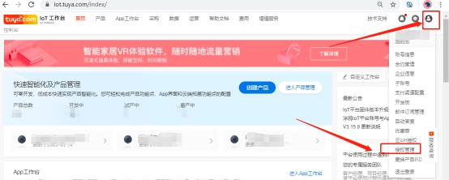
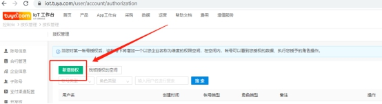
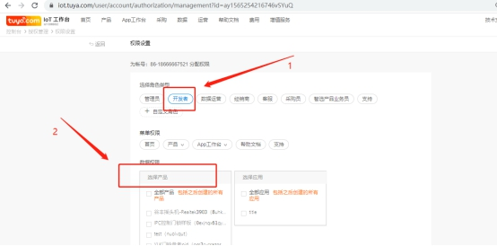
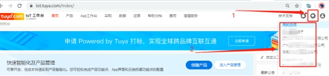
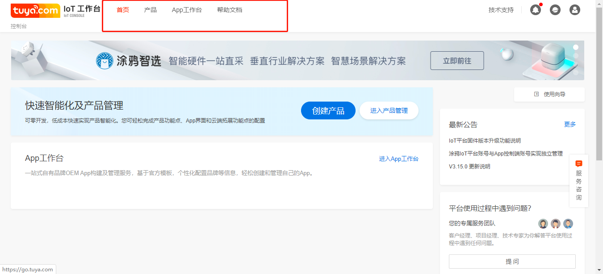

# IOT平台账号授权操作指引

* IoT平台帐号授权：  
* 作用：  

客户IoT平台授权工厂帐号管理PID，授权角色类型包括管理员、开发者、客户、采购员等。被授权后工厂可以在自己IoT帐号进入客户的IoT帐号空间，之后根据角色权限来管理客户PID，例：技术人员一般需要【开发者】权限，来管理dp点、OTA固件等。  

* 授权新账号指引：   
* A：客户账号下进入IoT平台首页，选择页面右上角个人中心下拉菜单的【授权管理】->点击新页面的【新增授权】输入被授权账号->选择新页面角色权限并勾选授权管理的PID。  

   

   

   

* B： 客户IoT账号完成授权后，工厂登录被授权账号，选择首页右上角空间图标  
   
点击进入客户公司的空间，如下图，权限和自己iot账号有所区别  

进入产品管理对产品进行查看操作    

