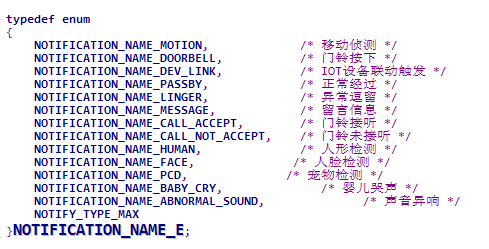
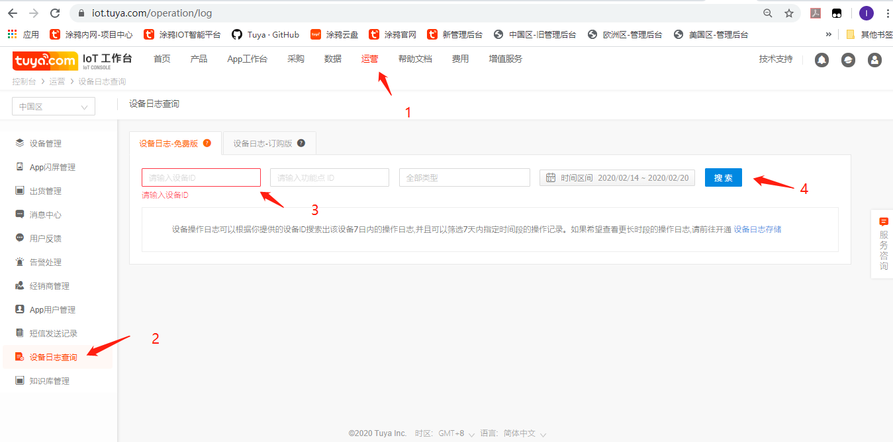

# 自定义事件图文告警开发
应用场景：  
当以下图片中的某个事件触发后，希望给app推送一条图文告警信息，报警的文案都是确定了的  
  
开发流程：  
1、跟项目经理沟通确认当前事件是否可以满足需求，如果满足请项目经理配置185dp点告警；如果不满足需要跟项目经理沟通定制设备端SDK，定制一个带新的事件告警的SDK  
3、当事件触发后调用tuya_ipc_notify_with_event推送告警  
```C
/**
 * \fn OPERATE_RET tuya_ipc_notify_with_event
 * \brief send a editable alarm to tuya cloud and APP
 * \param[in] snap_buffer: address of current snapshot
 * \param[in] snap_size: size fo snapshot, in Byte
 * \param[in] type: snapshot file type, jpeg or png
 * \param[in] name: editable event type, NOTIFICATION_NAME_E
 * \return OPERATE_RET
 */

OPERATE_RET tuya_ipc_notify_with_event(IN CONST CHAR_T *snap_buffer, IN CONST UINT_T snap_size, IN CONST NOTIFICATION_CONTENT_TYPE_E type, IN CONST NOTIFICATION_NAME_E name);

```
其中NOTIFICATION_NAME_E表示事件类型，snap_buffer表示图片数据，需保证图片数据有效且大小不超过100KB  
4、打开app上的推送通知权限  
5、我们SDK的自定义事件告警推送接口内部封装了一个固定的dp点185，常用的排查方法是在iot平台的运营中查询设备日志，输入当前调试的设备id(app中设备信息里面虚拟id)，选择当前日期进行日志查询  

  
6、确认设备有上报185dp点，且每次图片信息都不一致，排查方法和移动侦测类似


