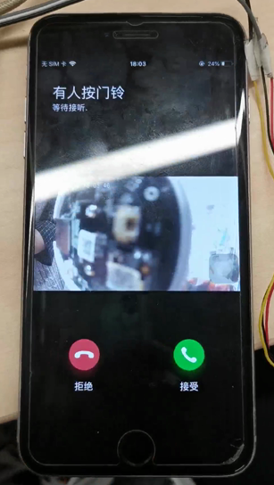
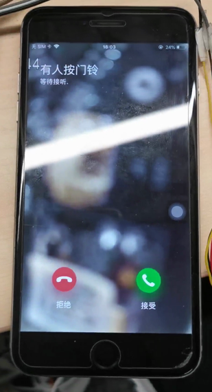

# 门铃推送告警  

开发流程：   
1、确认iot上已经配置好了告警  
2、门铃呼叫功能在APP上有两种表现形式：  
```C
typedef enum
{
    DOORBELL_NORMAL,    /* 普通门铃，推送图片 */
    DOORBELL_AC,        /* 直供电门铃，推送p2p */
    DOORBELL_TYPE_MAX,
}DOORBELL_TYPE_E;
/**
 * \fn OPERATE_RET tuya_ipc_door_bell_press
 * \brief send a doorbell pressing message to tuya cloud and APP
 * \param[in] doorbell_type: DOORBELL_NORMAL or DOORBELL_AC
 * \param[in] snap_buffer: address of current snapshot
 * \param[in] snap_size: size fo snapshot, in Byte
 * \param[in] type: snapshot file type, jpeg or png
 * \return OPERATE_RET
 */
OPERATE_RET tuya_ipc_door_bell_press(IN CONST DOORBELL_TYPE_E doorbell_type, IN CONST CHAR_T *snap_buffer, IN CONST UINT_T snap_size, IN CONST NOTIFICATION_CONTENT_TYPE_E type);

```
(1)、一种是图文告警加带图片门铃呼叫页面，选择app弹出的门铃呼叫中的接听则跳到改设备的预览界面实现方式如下：  
在按下设备门铃时，调用上面接口，DOORBELL_TYPE_E选择DOORBELL_NORMAL，传入的图片需要有效且大小不超过100kB  
  
(2)、一种是图文告警加带视频预览的门铃呼叫页面，选择app弹出的门铃呼叫中的接听直接在当前界面预览，优势是锁屏情况下无需输入密码进入设备，就可以实现预览对讲，实现方式如下：  
  
在按下设备门铃时，调用上面接口，DOORBELL_TYPE_E选择DOORBELL_AC，传入的图片需要有效且大小不超过100kB  
3、打开app上的推送通知权限，打开app自启动的权限  
4、我们SDK的门铃呼叫接口内部封装了两个固定的dp点136和154，常用的排查方法是在iot平台的运营中查询设备日志，输入当前调试的设备id(app中设备信息里面虚拟id)，选择当前日期进行日志查询  
  
5、确认设备有上报136和154dp点，且每次图片信息都不一致  