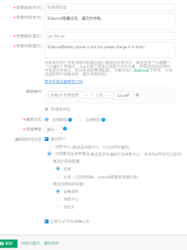

# IOT告警配置
配置告警前请确认iot账号的权限  
iot账号需要开通企业版以上，版本权限查询如下：  
https://iot.tuya.com/market/intro  

* 告警：  

IoT平台配置告警位置：https://iot.tuya.com/pmg/list  

在控制台-产品目录下，选中需要配置告警的产品（见下图）  
   

进入【告警设置】页面后，点击【新建告警】，配置产品需要告警信息  

   

在告警信息配置完成后，需要提供PID给到项目经理，通知其审核告警信息。在告警信息审核完成后，需要重新进入【告警设置】界面打开告警，之后APP清楚缓存测试。  
 

* 移动侦测告警：  

告警名称(中文)：移动侦测  

告警内容(中文)：${device}检查到移动  

告警名称(英文)：Movement detected  

告警内容(英文)：${device} has detected movement.  

触发条件：功能点/检测到移动-发生上报  

触发方式：连续触发  

告警等级：通知  

通知目标与方式： ●通知用户  

  ●应用推送及消息推送  

推送长短音配置：  

  ●短音  

推送消息跳转设置：  

  ●消息中心  

* 门铃呼叫告警：  

告警名称(中文)：门铃呼叫  

告警内容(中文)：${device}有人按门铃！  

告警名称(英文)：Someone's knocking  

告警内容(英文)：${device} someone is knocking!  

触发条件：功能点/门铃呼叫-不等于-Tony  

触发方式：连续触发  

告警等级：通知  

通知目标与方式：●通知用户  

●应用推送及消息推送   

推送长短音配置：  

  ●短音  

推送消息跳转设置：  

●自定义：panel?type=doorbell  
  

* 有人按门铃告警：   

告警名称(中文)：有人按门铃  

告警内容(中文)：${device}，有人按  

告警名称(英文)：Someone's knocking  

告警内容(英文)：${device} someone is knocking!  

触发条件：功能点/门铃图片-发生上报  

触发方式：连续触发  

告警等级：通知  

通知目标与方式：●通知用户  

 ●消息中心  
  

* 低电量告警：  
告警名称(中文)：低电量告警
告警内容(中文)：${device}电量过低，请及时充电。
告警名称(英文)：Low Power
告警内容(英文)：${device}Battery power is too low,please charge it in time！

触发条件：功能点/低电报警-小于等于- $dp147

触发方式：连续触发

告警等级：通知

通知目标与方式：●通知用户
             ●应用推送及消息推送
推送长短音配置：
   ●短音
推送消息跳转设置：
●设备面板 
