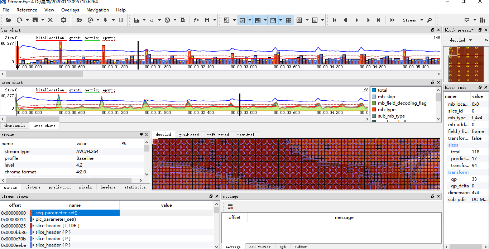
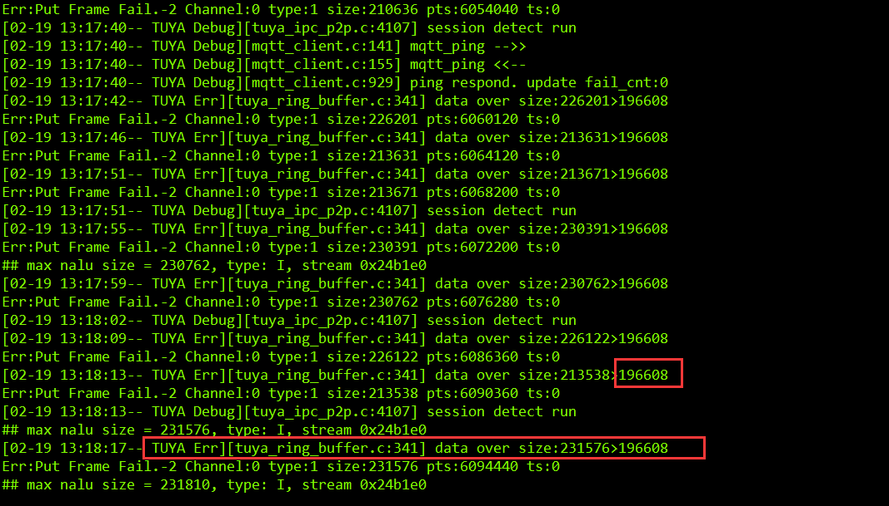

# 预览功能开发
* 开发流程：
* 在IPC_APP_Init_SDK中IPC_APP_Set_Media_Info设置视频参数     

```C
        s_media_info.channel_enable[E_CHANNEL_VIDEO_MAIN] = TRUE;    /* Whether to enable local HD video streaming */
        s_media_info.video_fps[E_CHANNEL_VIDEO_MAIN] = 30;  /* FPS */
        s_media_info.video_gop[E_CHANNEL_VIDEO_MAIN] = 30;  /* GOP */
        s_media_info.video_bitrate[E_CHANNEL_VIDEO_MAIN] = TUYA_VIDEO_BITRATE_1M; /* Rate limit */
        s_media_info.video_width[E_CHANNEL_VIDEO_MAIN] = 640; /* Single frame resolution of width*/
        s_media_info.video_height[E_CHANNEL_VIDEO_MAIN] = 360;/* Single frame resolution of height */
        s_media_info.video_freq[E_CHANNEL_VIDEO_MAIN] = 90000; /* Clock frequency */
        s_media_info.video_codec[E_CHANNEL_VIDEO_MAIN] = TUYA_CODEC_VIDEO_H264; /* Encoding format */
    }
```

  如上代码其中video_fps表示输入SDK中视频流的帧率，video_gop表示一组图像的帧数，video_bitrate表示视频流码率，video_width表示每帧图像的宽， video_height表示每帧图像的高，video_codec表示编码格式，channel_enable表示是否使能该通道，那么I帧间隔是gop/fps，例如fps为15，gop为30，则i帧间隔是2s即2s一个i帧，在开发视频预览功能时需要仔细核对以上编码信息是否和设备编码器编码出来的视频的编码信息一致(如果不确认参数是否一致，可以在把视频流送入sdk前保存视频裸数据到sd卡，在pc端用stream eye分析，同时该方法也能够用来分析画面出现马赛克、卡顿等问题，如下图)  
<div align=center></div>    

* 调用TUYA_APP_Init_Ring_Buffer参数初始化视频通道，在这个函数中主要调用 tuya_ipc_ring_buffer_init函数来初始化视频通道  
```C
/* initialize one ring buffer for one stream(one channel)
channel: ring buffer channel num, multipul channel for one 
bitrate: bitrate in Kbps
fps: framerate pre second
max_buffer_seconds: should be more than 1 GOP and less than 10 sencond. Set to 0 as default(10s).
requestIframeCB: call back function to request one I frame from video decoder. set to NULL if not needed or for NON-video stream.
*/
 OPERATE_RET tuya_ipc_ring_buffer_init(CHANNEL_E channel, UINT_T bitrate, UINT_T fps, UINT_T max_buffer_seconds, FUNC_REQUEST_I_FRAME requestIframeCB);  
```
需要注意的是:  
  max_buffer_seconds表示最大的视频缓存时间，换算成视频缓存空间大小是fps*max_buffer_seconds\*I帧的最大值（主码流300k，子码流200k），限制是这个参数的默认值为10s，最大值为10s，最小值为一个gop包含的时间(比如gop为20，fps为10,则这个最小值为gop/fps=2s)  
  requestIframeCB表示强制i帧的回调，需要用户主动实现这个回调，SDK会根据需要来调用，实现强制i帧可以优化出图时间  

* 开启线程调用TUYA_APP_Put_Frame往视频通道塞原始的视频帧数据，编码器每编码一帧就往SDK送一帧,，主要调用tuya_ipc_ring_buffer_append_data往具体的某个通道塞流，TUYA_APP_Put_Frame接口中的MEDIA_FRAME_S 这个结构体中包含timestamp和pts两个参数，实际开发者在TUYA_APP_Put_Frame传入的timestamp并没有传入tuya_ipc_ring_buffer_append_data这个接口，所以对于SDK来说timestamp参数是无效的，SDK内部会维护一个时间戳来进行音视频同步，实际传入的pts也没有用作音视频同步，但是音视频的pts是开发chromecast和echoshow重要参数，详情参考chromecast和echoshow开发章节。

```C
/* append new frame into a ring buffer
*/
OPERATE_RET tuya_ipc_ring_buffer_append_data(CHANNEL_E channel, UCHAR_T *addr, UINT_T size, MEDIA_FRAME_TYPE_E type, UINT64_T pts);  
```
参数说明：主要包含通道号，数据帧的大小类型等    
* mqtt上线后调用TUYA_APP_Enable_P2PTransfer(s_mgr_info.max_p2p_user)开启p2p初始化，max_p2p_user表示最大同时在线人数。  
* 特别说明：  
1、以上步骤就是视频预览开发的核心流程  
2、涂鸦 SDK 目前已经支持 H.264 和h265编码视频数据(h265请使用sdk版本4.7.4配合涂鸦智能app3.15.1版本进行调试)  
3、若需要占满 App 屏幕，视频分辨率请使用 16 : 9  
4、GOP建议为fps的2~3倍  
5、如果在开发过程中出现以下问题则问题为码流i帧的大小超过了SDK限制应该优化编码参数，如图片亮度、锐度等参数  
<div align=center></div>  
