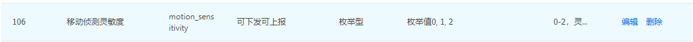

# 功能点开发  

* pid的概念  
  在涂鸦平台创建了一个产品之后，就会生成一个product id简称pid，这个pid在平台上表示一个产品id，在这个id下的所有设备功能都一致  

* dp点的概念  
  data point简称dp点，设备在创建pid的时候会选择一些功能，那么这些功能就是代码中的dp点，设备端和app上一些功能点的配置，事件推送都是基于dp点实现的，可以理解为dp点就是设备端和app进行数据传输的通道，关于配置的dp数据由开发者进行保存和读取。    

* 项目立项后涂鸦项目经理会根据开发者的需求为客户创建pid，配置好相关dp点和告警，客户如需更改dp点需联系项目经理，先进行沟通后再进行修改，修改后需要把调试中的设备重新配网，如果不重新配网会出现dp点无法上报下发等异常情况（很重要）     
* dp点按数据类型分类：  
    

    

    

    

    
* 功能点开发：  
确认设备的功能，打开iot平台功能定义界面，确认开发的功能，选择正确的dp点，确认dp点数据类型，参考SDK中的demo进行开发，SDK中只选择了一部分比较常用的dp点进行开发，如果碰到sdk中没有的dp点，需要参考类似dp的数据处理流程开发新dp点的下发和上报以及对应功能的数据的处理  
1、布尔类型的案例：  
```C
#ifdef TUYA_DP_LIGHT
STATIC VOID handle_DP_LIGHT(IN TY_OBJ_DP_S *p_obj_dp)
{
    BOOL_T light_on_off = check_dp_bool_invalid(p_obj_dp);

    IPC_APP_set_light_onoff(light_on_off);
    light_on_off = IPC_APP_get_light_onoff();

    respone_dp_bool(TUYA_DP_LIGHT, light_on_off);
}
#endif
```
2、枚举类型的案例：  
```C
#ifdef TUYA_DP_NIGHT_MODE
STATIC VOID handle_DP_NIGHT_MODE(IN TY_OBJ_DP_S *p_obj_dp)
{
    if( (p_obj_dp == NULL) || (p_obj_dp->type != PROP_ENUM) )
    {
        printf("Error!! type invalid %d \r\n", p_obj_dp->type);
        return;
    }
    CHAR_T tmp_str[2] = {0};
    tmp_str[0] = '0' + p_obj_dp->value.dp_enum;

    IPC_APP_set_night_mode(tmp_str);
    CHAR_T *p_night_mode = IPC_APP_get_night_mode();

    respone_dp_enum(TUYA_DP_NIGHT_MODE, p_night_mode);
}
#endif
```
3、数值类型的举例：  
```C
#ifdef TUYA_DP_SD_STATUS_ONLY_GET
STATIC VOID handle_DP_SD_STATUS_ONLY_GET(IN TY_OBJ_DP_S *p_obj_dp)
{
    INT_T sd_status = IPC_APP_get_sd_status();

    respone_dp_value(TUYA_DP_SD_STATUS_ONLY_GET, sd_status);
}
#endif
```
4、string类型的举例：
```C
#ifdef TUYA_DP_SD_STORAGE_ONLY_GET
STATIC VOID handle_DP_SD_STORAGE_ONLY_GET(IN TY_OBJ_DP_S *p_obj_dp)
{
    CHAR_T tmp_str[100] = {0};

    UINT_T total = 100;
    UINT_T used = 0;
    UINT_T empty = 100;
    IPC_APP_get_sd_storage(&total, &used, &empty);

    //"total capacity|Current usage|remaining capacity"
    snprintf(tmp_str, 100, "%u|%u|%u", total, used, empty);
    respone_dp_str(TUYA_DP_SD_STORAGE_ONLY_GET, tmp_str);
}
#endif
```
说明：string类型的数据格式，需要有数据格式，大部分string类型的dp点SDK中都已经实现了，在实际应用中请对比SDK中demo的实现，在面板定制的需求中需要确认好通信协议，确认好数据格式，比较多的是用CJson格式。  
比如发送的数据是{"169":"{\"num\":1,\"region0\":{\"x\":0,\"y\":0,\"xlen\":50,\"ylen\":50}}"}
那么在组合数据的时候需要在双引号前加三个\\\，可以参考169dp点的数据组合方式：     
```C
 if (0 == i){
            snprintf(s_alarm_zone, 256,"{\\\"num\\\":%d",strAlarmZoneInfo.iZoneNum);
        }
snprintf(region, 64, ",\\\"region%d\\\":{\\\"x\\\":%d,\\\"y\\\":%d,\\\"xlen\\\":%d,\\\"ylen\\\":%d}",i,strAlarmZoneInfo.alarmZone[i].pointX,\
            strAlarmZoneInfo.alarmZone[i].pointY,strAlarmZoneInfo.alarmZone[i].width,strAlarmZoneInfo.alarmZone[i].height);
```
5、raw数据格式：
这个数据格式不会让客户者自己去调用，都是SDK封装好的，设备端调用接口成功上报后iot平台日志也能查找到相关dp数据，例如移动侦测告警调用tuya_ipc_notify_motion_detect上报115dp点，raw数据为图片；自定义图文事件告警tuya_ipc_notify_with_event上报185dp点，数据为raw数据；门铃呼叫tuya_ipc_door_bell_press上报136和154dp点，136为字符型，154为raw型图片数据，关于raw数据相关的详细功能的开发可参考告警开发章节。   
* 在实际开发中怎么能确认数据组合的没有问题呢？  
1、首先确认调用respone_dp_str等函数上报数据的时候设备日志没有报error  
2、在iot开发者平台中的日志查询界面中查看该dp是否有上报，以及上报的数据是否和协议规定的一样  


