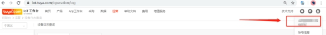
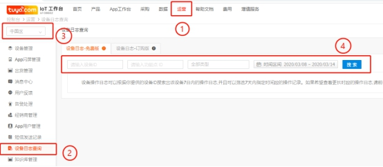

# iot日志查询方法

* IoT平台查日志：

* 作用：

IoT平台查询设备日志，应用于设备工作状态查询与设备问题排查的辅助。

 

* 帐号查询条件：

1 IoT帐号级别需要升级为企业版帐号(下图)

2.1确认设备PID在IoT帐号，平台可以查询IoT帐号下PID的设备日志

2.2 IoT帐号在被授权为带有【运营】权限的角色且关联到PID时，可以查询对应PID所属的设备日志

 

 

* 日志查询操作：

在IoT平台首页点击顶部【运营】->点击【设备日志查询】->选择正确的设备配网区域【中国区】或其他->输入设备ID并选择查询时间->点击【搜索】

 

 

 